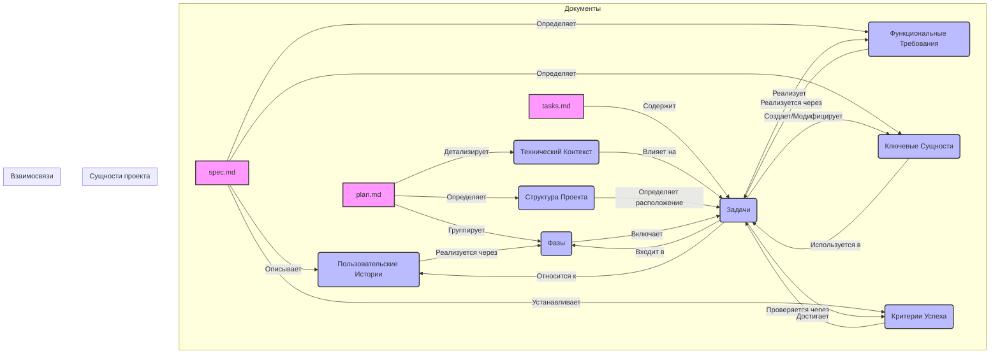

# Отчет по семантической модели и анализу согласованности

## 1. Введение

Данный отчет представляет собой семантическую модель проекта "Рефакторинг проекта для расчёта усушки и учёта по партиям", построенную на основе анализа документов `spec.md`, `plan.md` и `tasks.md`. Целью является выявление ключевых сущностей, их атрибутов и взаимосвязей, а также проверка согласованности между различными документами проекта.

## 2. Обзор извлеченных сущностей

### Пользовательские истории (User Stories)

Описывают функциональность с точки зрения пользователя, его цели и ожидаемый результат.
- **User Story 1 - Упрощённый импорт отчётов (Приоритет: P1)**:
  - Описание: Импорт Excel-отчётов с данными о движении товаров и остатках в плоскую таблицу.
  - Независимый тест: Загрузка Excel-файла и получение плоской таблицы.
  - Сценарии приемки: 2 сценария, описывающих успешный импорт и обработку нестандартных структур.
- **User Story 2 - Расчёт усушки по упрощённой логике (Приоритет: P1)**:
  - Описание: Расчёт усушки по товарным позициям без сложных FIFO-расчётов.
  - Независимый тест: Ввод плоской таблицы данных и получение отчёта по усушке.
  - Сценарии приемки: 2 сценария, описывающих расчёт усушки и выделение отрицательных остатков.
- **User Story 3 - Аудит и проверка остатков (Приоритет: P2)**:
  - Описание: Проверка корректности остатков, выявление отрицательных остатков и излишков.
  - Независимый тест: Проверка остатков на готовой плоской таблице.
  - Сценарии приемки: 2 сценария, описывающих аудит остатков и выделение подозрительных движений.
- **User Story 4 - Экспорт и отчёты в разных форматах (Приоритет: P3)**:
  - Описание: Экспорт результатов расчётов в JSON, Markdown, SQLite.
  - Независимый тест: Тестирование экспорта на готовом результате расчёта.
  - Сценарии приемки: 2 сценария, описывающих экспорт в JSON и Markdown.

### Функциональные требования (Functional Requirements)

Конкретные требования к поведению системы.
- **FR-001**: Преобразование Excel-отчётов в плоскую таблицу.
- **FR-002**: Вычисление усушки по упрощённой логике.
- **FR-003**: Проверка остатков на отрицательные значения.
- **FR-004**: Экспорт результатов в JSON, Markdown, SQLite.
- **FR-005**: Покрытие кода типизацией (MyPy strict) и юнит-тестами (80% общее, 95% domain/application).
- **FR-011**: Разделение архитектуры на слои: domain, application, infrastructure, presentation.
- **FR-007**: Использование dataclasses и TypedDict для структурирования данных.
- **FR-008**: Плоская, легко тестируемая структура без глубоких классовых связей.
- **FR-009**: Быстрый импорт, расчёт и экспорт.
- **FR-010**: Функции аудита минусовых остатков и излишков.

### Ключевые сущности (Key Entities)

Основные объекты данных, используемые в системе.
- **BatchMovement**: движение товара по партии (номенклатура, дата, тип_движения, количество, склад).
- **BatchBalance**: остаток товара по партии (номенклатура, дата, остаток, склад, партия).
- **ShrinkageCalculation**: результат расчёта усушки (номенклатура, рассчитанная_усушка, фактический_остаток, отклонение).

### Критерии успеха (Success Criteria)

Измеримые показатели успешности реализации.
- **SC-001**: Импорт Excel-отчёта и получение плоской таблицы за <30 секунд.
- **SC-002**: Расчёт усушки по данным за месяц за <1 минуту.
- **SC-003**: Покрытие юнит-тестами (domain/application) >= 95%.
- **SC-004**: Полный цикл (импорт → расчёт → экспорт → аудит) за <5 минут.
- **SC-005**: >= 95% пользователей успешно завершают основной сценарий.
- **SC-006**: Обработка файлов объёмом до 100МБ без сбоев.
- **SC-007**: Запуск системы и базовый расчёт за 5 минут после установки.

### Фазы (Phases)

Высокоуровневые этапы реализации проекта.
- **Phase 1: Настройка (Общая инфраструктура)**: Инициализация проекта и базовая структура.
- **Phase 2: Базовая (Блокирующие предварительные условия)**: Базовая инфраструктура, блокирующая пользовательские истории.
- **Phase 3: Пользовательская история 1 - Упрощённый импорт отчётов (Приоритет: P1) 🎯 MVP**: Реализация упрощённого импорта Excel-отчётов.
- **Phase 4: Пользовательская история 2 - Расчёт усушки по упрощённой логике (Приоритет: P1)**: Реализация расчёта усушки.
- **Phase 5: Пользовательская история 3 - Аудит и проверка остатков (Приоритет: P2)**: Реализация аудита остатков.
- **Phase 6: Пользовательская история 4 - Экспорт и отчёты в разных форматах (Приоритет: P3)**: Реализация экспорта результатов.
- **Phase 7: Пользовательский интерфейс и CLI**: Обновление UI и CLI.
- **Phase N: Доработка и сквозные вопросы**: Улучшения, затрагивающие несколько историй.

### Задачи (Tasks)

Детализированные шаги для выполнения проекта.
- **T001-T003a**: Задачи по настройке проекта (структура, зависимости, инструменты).
- **T004-T007**: Базовые инфраструктурные задачи (БД, пакеты, логирование, конфигурация).
- **T010-T017**: Задачи для Пользовательской истории 1 (тесты, dataclasses, парсер, валидация, логи).
- **T018-T023**: Задачи для Пользовательской истории 2 (тесты, стратегия усушки, use cases).
- **T024-T028**: Задачи для Пользовательской истории 3 (тесты, use cases аудита).
- **T029-T034**: Задачи для Пользовательской истории 4 (тесты, интерфейсы экспорта, реализация экспорта).
- **T035-T038**: Задачи по UI и CLI (обновление Streamlit, создание CLI).
- **T101-T117**: Задачи по реализации функциональных требований и критериев успеха, которые не были напрямую связаны с конкретными задачами T0XX.

## 3. Анализ согласованности и обнаруженные несоответствия

### Соответствие Функциональных Требований (FR-XXX) и Задач (TXXX)

Большинство функциональных требований из `spec.md` имеют соответствующие задачи в `tasks.md` (T101-T110), что указывает на хорошее покрытие требований в плане реализации. Однако, стоит отметить, что эти задачи `T101-T110` являются обобщенными и не детализируют, как именно эти требования будут реализованы в коде. Они скорее являются "обязательствами", чем конкретными шагами.

### Соответствие Критериев Успеха (SC-XXX) и Задач (TXXX)

Аналогично, критерии успеха из `spec.md` также отражены в обобщенных задачах `T111-T117` в `tasks.md`. Это обеспечивает трассируемость, но не дает конкретных шагов для достижения этих критериев в рамках выполнения проекта.

### Соответствие Пользовательских Историй и Задач

Пользовательские истории хорошо детализированы в `tasks.md` через конкретные задачи (T010-T038), что позволяет отслеживать прогресс по каждой истории. Существует явная связь между User Story и соответствующими задачами.

### Соответствие Ключевых Сущностей и Структуры Проекта

Ключевые сущности, такие как `BatchMovement`, `BatchBalance`, `ShrinkageCalculation`, упомянуты в `plan.md` как dataclasses, которые будут созданы в `src/shield_ai/domain/entities/`. Это соответствует архитектурному решению и указывает на согласованность.

### Согласованность между `plan.md` и `tasks.md`

- **Структура проекта:** `plan.md` описывает желаемую структуру проекта (`src/shield_ai/domain/entities/`, `src/shield_ai/application/use_cases/` и т.д.), и `tasks.md` содержит задачи по созданию файлов в этих директориях (например, `T012`, `T013`, `T014`, `T015`, `T020`, `T021`, `T022`, `T026`, `T027`, `T028`, `T031`, `T032`, `T033`, `T034`, `T035`, `T036`, `T037`). Это обеспечивает хорошую согласованность между планом и задачами.
- **Фазы:** `plan.md` определяет фазы реализации, и `tasks.md` группирует задачи по этим фазам, что способствует структурированному подходу к разработке.
- **Технический контекст:** Технический контекст из `plan.md` (Python 3.12, pandas, streamlit, SQLAlchemy, pytest, синхронный код, типизация) хорошо согласуется с задачами по настройке проекта (T001-T003a) и общими принципами разработки.

### Обнаруженные пробелы и рекомендации

1.  **Детализация задач для FR-XXX и SC-XXX:** Задачи `T101-T117` являются высокоуровневыми. Рекомендуется детализировать их до более конкретных, атомарных шагов, которые напрямую соответствуют реализации каждого функционального требования и критерия успеха. Это улучшит отслеживаемость и упростит выполнение.
2.  **Граничные случаи:** В `spec.md` перечислены граничные случаи, но в `tasks.md` нет явных задач, которые бы прямо касались их обработки. Рекомендуется добавить конкретные задачи по тестированию и реализации обработки граничных случаев в `tasks.md`.
3.  **Документация и рефакторинг:** `tasks.md` содержит общие задачи по доработке (`TXXX [P] Обновления документации в docs/`, `TXXX Очистка и рефакторинг кода`). Необходимо конкретизировать эти задачи, указав, какие именно разделы документации нужно обновить и какие области кода требуют рефакторинга.

## 4. Визуализация семантической модели (Mermaid Diagram)

## 5. Заключение и рекомендации

Семантическая модель проекта достаточно хорошо структурирована, и основные сущности и их взаимосвязи извлечены. Общая согласованность между `spec.md`, `plan.md` и `tasks.md` находится на хорошем уровне, особенно в части пользовательских историй и структуры проекта.

Основная рекомендация заключается в **дальнейшей детализации задач `T101-T117` в `tasks.md`**, чтобы они представляли собой конкретные, выполнимые шаги, а не просто дублировали формулировки требований и критериев успеха. Также необходимо **добавить явные задачи для обработки граничных случаев**, описанных в `spec.md`.